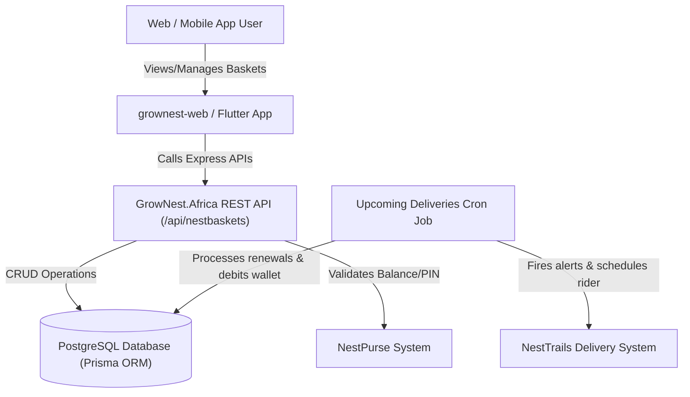
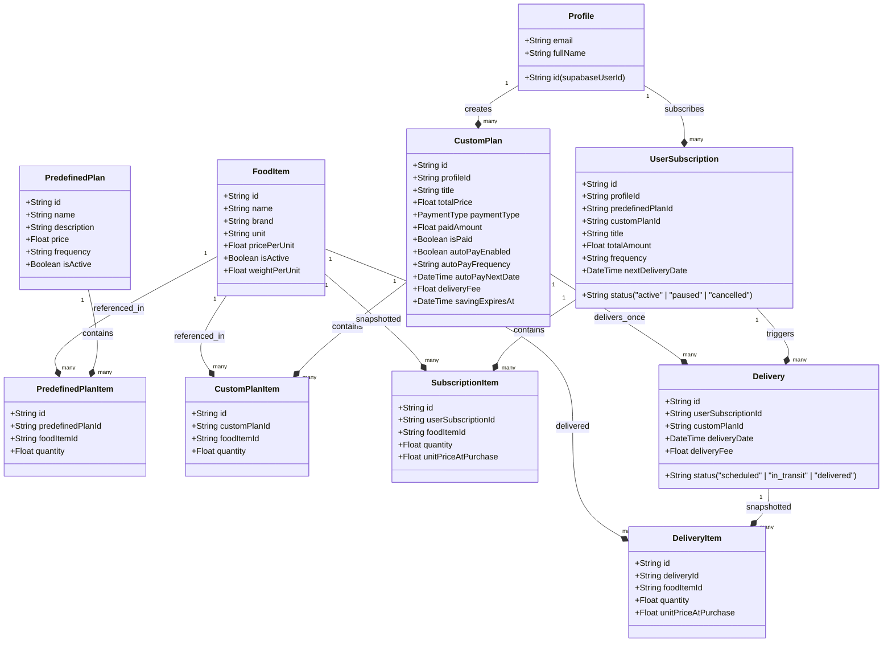

# NestBaskets: Architectural Analysis & Web Frontend Roadmap

An architectural analysis of the **NestBaskets** subsystem across the `GrowNest.Africa` (Node.js/Express backend) and `grownest-web` (Next.js/React frontend) codebases. It details how the existing backend system is structured, how it supports the production Flutter app without breaking changes, and outlines a step-by-step implementation plan to build the web buyer portal UI.

---

## 1. System Overview & Concept

**NestBaskets** is a core sub-service of the GrowNest ecosystem that allows users to save towards or subscribe to regular deliveries of curated or custom food baskets. It leverages the **NestPurse** (digital wallet) for automated payments and recurring deductions.



### Clarifying the Custom Plan Modes (Backend Integration)

The backend provides two primary payment workflows for custom-created baskets via the `paymentType` field inside the `CustomPlan` table.

```
                  ┌─────────────────────────────────────────┐
                  │           User creates Custom           │
                  │        Basket (CustomPlan model)        │
                  └────────────────────┬────────────────────┘
                                       │
                    Selects paymentType enum in Zod Schema
                                       │
              ┌────────────────────────┴────────────────────────┐
              ▼                                                 ▼
     [paymentType: "subscription"]                     [paymentType: "flexible"]
   (Custom Subscription Mode)                       (Custom Flexible Savings Mode)
              │                                                 │
  Subscribes to recurring delivery                    Saves towards target amount over time
   (weekly/monthly/quarterly)                          via manual savings or auto-pay rules
              │                                                 │
 Auto-debited + delivered each cycle                Baskets locked until 100% saved (fully paid)
              │                                                 │
  Continuous cycle until paused                     One-time delivery scheduled when requested
```

1. **Custom Subscription Mode (`paymentType: "subscription"`)**:
   - The user selects custom items from `/api/nestbaskets/food-items` and designs their own custom basket.
   - Upon creating the custom plan with `paymentType: "subscription"`, they call `/api/nestbaskets/subscribe` to set a recurring cycle frequency (weekly, monthly, quarterly, yearly).
   - The system automatically debits their `NestPurse` and schedules a new delivery at the beginning of each cycle, providing a continuous recurring groceries pipeline.

2. **Custom Flexible Savings Mode (`paymentType: "flexible"`)**:
   - The user creates a custom plan with `paymentType: "flexible"`, setting a target amount and saving end date (`savingExpiresAt`).
   - They save toward this target over time by:
     - **Manual contributions**: Depositing arbitrary amounts (minimum ₦500) via `POST /flexible-payment`.
     - **Auto-Pay deposits**: Setting up daily, weekly, biweekly, or monthly recurring transfers using `POST /auto-pay/setup` to automatically save a set amount from their `NestPurse`.
   - The basket remains locked and cannot be fulfilled until **100% of the target is saved**. Once fully funded, the status changes to `ready_for_delivery` and a single one-time delivery is scheduled upon user request.

---

## 2. Database Model & Relationship Map

The PostgreSQL schema (managed by Prisma in `schema.prisma`) is highly structured, mapping plans, snapshots, subscriptions, and deliveries.



> [!NOTE]
> **Why snapshotted prices matter:** When a subscription or delivery is created, the system copies `unitPriceAtPurchase` to the item snapshots. This protects users from unexpected price fluctuations during an active subscription cycle while allowing the store to update food prices over time.

---

## 3. Existing Live Backend REST APIs (`/api/nestbaskets`)

The backend is fully complete and production-tested. **Crucially, the mobile app is live, so no existing endpoint behaviors or JSON shapes can be altered/broken.**

### 🔓 Public / General Endpoints
* **`GET /plans/predefined`**: Returns a list of all active predefined bundles (e.g., "Mama Monthly Plan") including their component `FoodItem` objects, brands, prices, and images.
* **`GET /food-items`**: Returns all active custom ingredients, weights, brands, prices, and units available for creating custom flexible/subscription baskets.

### 🔒 User-Authenticated Endpoints (Requires Supabase JWT)
* **`GET /plans`**: Returns a unified list of available options: all predefined plans AND the user's created custom plans, enriched with subscription status.
* **`GET /plan/:id`**: Gets full detail of a specific predefined or custom plan, along with active subscription parameters.
* **`POST /custom-plan`**: Saves a new custom basket draft. Accepts items, `paymentType` (`subscription` | `flexible`), delivery profile, and saving expiry date. Returns computed totals.
* **`PATCH /custom-plan/:id/address`**: Updates the delivery profile for a custom plan and automatically recalculates the progressive weight-based delivery fee.
* **`POST /subscribe`**: Subscribes to a predefined or custom plan. Checks the user's wallet PIN, validates their balance, deducts the initial fee, and schedules the first delivery.
* **`GET /my-subscriptions`**: Fetches all the user's active recurring subscriptions.
* **`GET /subscription/:id`**: Fetches granular details of a subscription, including past delivery history and payment log.
* **`PATCH /subscription/:id/pause`**: Temporarily freezes a subscription.
* **`PATCH /subscription/:id/resume`**: Re-activates a paused subscription and calculates a fresh `nextDeliveryDate`.
* **`DELETE /subscription/:id`**: Cancels a subscription and automatically **refunds** the user's `NestPurse` if they've paid for the current cycle but the delivery hasn't been fulfilled.
* **`GET /my-flexible-plans`**: Fetches all active savings plans with computed progress bars (e.g., "75% saved").
* **`GET /flexible-plan/:id`**: Granular dashboard view for a single savings target.
* **`POST /flexible-payment`**: Saves money from `NestPurse` into the flexible plan. Enforces a ₦500 minimum. If the plan becomes 100% funded, locks the plan as "ready_for_delivery".
* **`POST /auto-pay/setup`**: Activates a recurring automation (e.g., daily, weekly) to auto-save money from the user's wallet into their basket.
* **`POST /auto-pay/disable`**: Disables auto-pay savings.
* **`DELETE /custom-plan/:id`**: Deletes a flexible custom plan and **refunds all accrued savings** instantly back to the user's `NestPurse`.

---

## 4. Analysis of current `grownest-web` state

The `grownest-web` repository currently contains a complete Next.js 14 project, fully wired with Lucide Icons, Tailwind CSS, shadcn/ui components, and SWR for state management. 

However:
1. **No NestBaskets UI exists**: The directory `app/savings` contains subfolders for `eggs`, `group`, and `locked` (which represent pure financial savings products), but nothing for recurrent grocery baskets.
2. **"My Baskets" confusion**: The sidebar navigation item `"My Baskets"` routes to `/marketplace/baskets`. As documented in `2026-05-31-nestmarkets-buyer-portal-design.md`, this page acts as the **standard marketplace shopping cart** for physical stores. It is **not** the recurring/flexible "NestBaskets" subscription system.
3. **No NestBaskets API helper**: The frontend file `lib/nestbaskets-api.ts` currently only lists endpoints for `nesttrails` (delivery profiles and delivery zone calculations). The actual NestBaskets recurring endpoints (`/api/nestbaskets/*`) are not implemented.

---

## 5. Web Frontend Integration Roadmap (Step-by-Step)

To integrate NestBaskets into `grownest-web` with stunning, premium aesthetics, the following checklist must be executed.

### Phase 1: Foundation & Types
- [ ] **Step 1.1: Define TypeScript Typings**
  Add models for `FoodItem`, `PredefinedPlan`, `CustomPlan`, `UserSubscription`, `SubscriptionPayment`, and `Delivery` into `types/nestbaskets.ts`.
- [ ] **Step 1.2: Extend NestBaskets API Helper**
  Update `lib/nestbaskets-api.ts` to include high-fidelity `api` calls wrapping `/api/nestbaskets/*` endpoints:
  ```typescript
  export const nestBasketsApi = {
    // ... existing delivery profile calls ...
    
    // NestBaskets Core
    getPredefinedPlans: () => api.get<ApiResponse<PredefinedPlan[]>>("/api/nestbaskets/plans/predefined"),
    getAllPlans: () => api.get<ApiResponse<{ predefined: PredefinedPlan[]; custom: CustomPlan[] }>>("/api/nestbaskets/plans"),
    getPlanDetails: (id: string) => api.get<ApiResponse<any>>(`/api/nestbaskets/plan/${id}`),
    getFoodItems: () => api.get<ApiResponse<FoodItem[]>>("/api/nestbaskets/food-items"),
    createCustomPlan: (data: any) => api.post<ApiResponse<CustomPlan>>("/api/nestbaskets/custom-plan", data),
    updateCustomPlanAddress: (id: string, deliveryProfileId: string) => api.patch<ApiResponse<any>>(`/api/nestbaskets/custom-plan/${id}/address`, { deliveryProfileId }),
    subscribeToPlan: (data: any) => api.post<ApiResponse<any>>("/api/nestbaskets/subscribe", data),
    
    // Subscriptions Management
    getMySubscriptions: () => api.get<ApiResponse<any[]>>("/api/nestbaskets/my-subscriptions"),
    getSubscriptionDetails: (id: string) => api.get<ApiResponse<any>>(`/api/nestbaskets/subscription/${id}`),
    pauseSubscription: (id: string) => api.patch<ApiResponse<any>>(`/api/nestbaskets/subscription/${id}/pause`),
    resumeSubscription: (id: string) => api.patch<ApiResponse<any>>(`/api/nestbaskets/subscription/${id}/resume`),
    cancelSubscription: (id: string) => api.delete<ApiResponse<any>>(`/api/nestbaskets/subscription/${id}`),
    
    // Flexible Savings Baskets
    getMyFlexiblePlans: () => api.get<ApiResponse<any[]>>("/api/nestbaskets/my-flexible-plans"),
    getFlexiblePlanDetails: (id: string) => api.get<ApiResponse<any>>(`/api/nestbaskets/flexible-plan/${id}`),
    makeFlexiblePayment: (data: any) => api.post<ApiResponse<any>>("/api/nestbaskets/flexible-payment", data),
    setupAutoPay: (data: any) => api.post<ApiResponse<any>>("/api/nestbaskets/auto-pay/setup"),
    disableAutoPay: (data: any) => api.post<ApiResponse<any>>("/api/nestbaskets/auto-pay/disable", data),
    deleteCustomPlan: (id: string, pin?: string) => api.delete<ApiResponse<any>>(`/api/nestbaskets/custom-plan/${id}`, { pin }),
  };
  ```

---

### Phase 2: Navigation & Layout Adjustments
- [ ] **Step 2.1: Disambiguate Baskets & Subscriptions**
  In the main app sidebar `components/app-sidebar.tsx`, keep `"My Cart"` routing to `/marketplace/baskets`, but add a dedicated **"Food Baskets"** entry routing to `/nestbaskets/baskets` to represent recurring and flexible custom meal plans, separating it clearly from the pure cash `savings/*` (NestEggs) module.
- [ ] **Step 2.2: Build `/nestbaskets/baskets` Layout**
  Create `app/nestbaskets/baskets/page.tsx` with a premium dashboard tabs interface:
  * **Tab 1: Predefined Bundles**: Showcases "Mama Monthly", "Papa Family Pack" with beautiful cards, images, and prices.
  * **Tab 2: My Active Baskets**: Split dynamically into **"Subscriptions"** (active/paused schedules, predefined or custom-created) and **"Flexible Savings Baskets"** (shows interactive progress rings and quick-save CTAs).

---

### Phase 3: Premium UI Screens & Components
- [ ] **Step 3.1: Interactive Custom Basket Builder (`/nestbaskets/baskets/new`)**
  Create an engaging, checklist-based Custom Basket Creator page:
  * Fetch `GET /food-items` to show catalog.
  * Allow adjusting quantities, calculating live weights, total prices, and real-time delivery estimates.
  * Select target type: **Recurring Subscription** vs **Flexible Target Goal**.
  * Choose target saving date (mandatory for flexible targets).
- [ ] **Step 3.2: Subscription Dashboard Details Page (`/nestbaskets/baskets/subscription/[id]`)**
  Create a gorgeous management hub allowing users to:
  * View scheduled deliveries on a timeline calendar.
  * Toggle **Pause/Resume** with smooth animations.
  * Trigger safe **Cancellation** with clear messaging about active `NestPurse` refunds.
- [ ] **Step 3.3: Flexible Savings Goal Hub (`/nestbaskets/baskets/flexible/[id]`)**
  A high-engagement visual saving portal:
  * Custom circular progress animations showing how close the user is to their target.
  * A "Save Now" quick-deposit drawer pulling instantly from `NestPurse`.
  * **Auto-Pay Planner**: Toggle daily/weekly savings rules with a beautiful custom switch.
  * **Address recalculator** so users can swap addresses pre-delivery.

---

### Phase 4: Security & Transaction Flows
- [ ] **Step 4.1: Seamless Wallet PIN Verification Drawer**
  To respect backend transaction guards, implement a reusable 4-digit security PIN modal. It should pop up automatically whenever the user:
  * Subscribes to a recurring plan.
  * Submits a manual savings installment (flexible payment).
  * Deletes/cancels a flexible savings target.
- [ ] **Step 4.2: Grace Period & Renewal Error Management**
  Since backend auto-debits can fail on low wallet balance (firing a `nestbasket_payment_failed` activity), create custom alert components warning the user if their subscription is in "Grace Period" or if their card is locked.

---

### Phase 5: Backend Sweeper Adjustments & Bug Fixes
- [ ] **Step 5.1: Global Grace Period Toggle Support**
  Introduce a new global setting `custom_plan_grace_period_enabled` (boolean). Add a toggle Switch on the Admin Dashboard settings tab (`Admin-GrowNest`) to enable/disable it.
- [ ] **Step 5.2: Implement Individual Grace Period Override**
  Modify the backend sweeper ([expireFlexiblePlans.ts](file:///c:/Users/hp/Desktop/GrowNest.Africa/src/jobs/expireFlexiblePlans.ts#L35)) and plan status checks ([nestbaskets.ts](file:///c:/Users/hp/Desktop/GrowNest.Africa/src/routes/nestbaskets.ts)) to calculate expiration based on the following precedence:
  1. If `gracePeriodEndsAt` is set on a plan, use it as the hard deadline (it overrides any global setting, active or inactive).
  2. If `gracePeriodEndsAt` is not set:
     - If global grace period is **enabled**, the deadline is `savingExpiresAt` + default grace duration.
     - If global grace period is **disabled**, the deadline is simply `savingExpiresAt` (expires immediately after target date).
- [ ] **Step 5.3: Filter Out Cancelled/Refunded Custom Plans**
  Fix list queries (such as `/my-flexible-plans` and `/plans` in [nestbaskets.ts](file:///c:/Users/hp/Desktop/GrowNest.Africa/src/routes/nestbaskets.ts)) to filter out plans with `status: "cancelled"` from active dashboard views.

---

## 6. Verification and Quality Safeguards

To ensure no breaking changes are introduced on the live API:
1. **Strict Types Mapping**: Ensure TypeScript contracts match backend models exactly.
2. **Safe PIN Fallbacks**: Check if the user has a transaction PIN set before prompting for it, matching the backend's `requirePin` JSON response.
3. **Optimistic Updates**: Use SWR mutating strategies on pause/resume toggles for instant visual feedback.
4. **Responsive Flex-Layouts**: Test using standard viewports to ensure seamless scaling from desktop down to mobile browser screens.

---

> [!TIP]
> **Premium Styling Cue:**
> We will design the interface in strict harmony with the codebase's existing warm luxury color palette defined in `globals.css`:
> - **Primary Brand Color**: Gold/Yellow (`oklch(0.72 0.16 84)` or `#c9a054` equivalent) representing successful harvest growth and digital NestEggs.
> - **Secondary Accent Color**: Rich warm Bronze/Brown (`oklch(0.63 0.12 65)`) representing earth, seeds, and baskets.
> - **Card / Panel Surfaces**: Smooth light warm oklch tints and dark mode alternatives, paired with glassmorphism (`bg-card/85 backdrop-blur-md border-border/80`).
